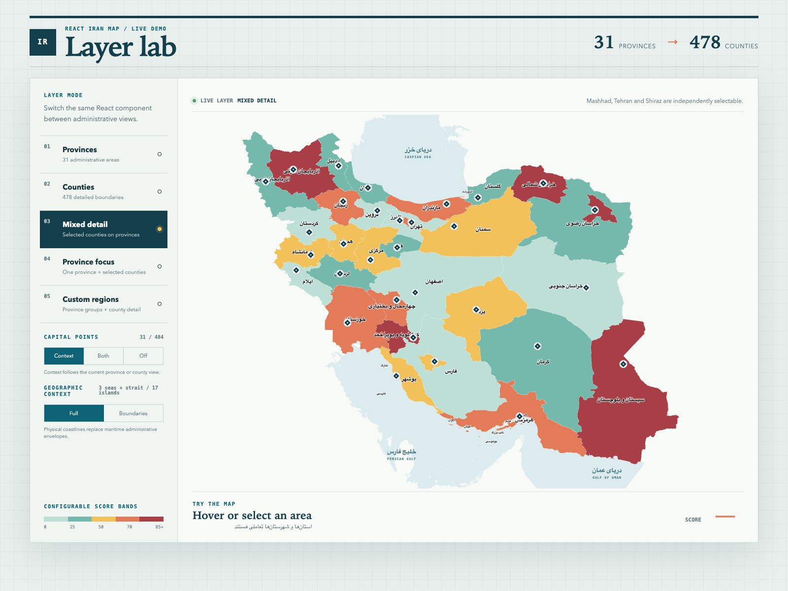
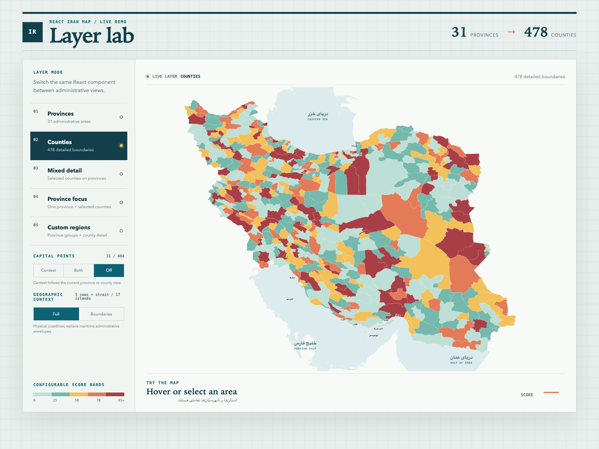

# @msameim181/iran-map-react

Interactive, responsive SVG map of Iran for React: 31 provinces, 478 counties, custom regions, choropleth color bands, capital markers, seas and islands. A thin React layer over [`@msameim181/iran-map-core`](https://github.com/Msameim181/iran-map-core), which owns the data and all the logic.

[**Open the live demo →**](https://msameim181.github.io/iran-map-react/)



## Installation

The package is published to **GitHub Packages**. Point the `@msameim181` scope at it in your project's `.npmrc`:

```ini
@msameim181:registry=https://npm.pkg.github.com
```

GitHub Packages requires authentication **even for public packages**: create a token with the `read:packages` scope and add it to your user-level `~/.npmrc` (never commit it):

```ini
//npm.pkg.github.com/:_authToken=YOUR_TOKEN
```

```bash
npm install @msameim181/iran-map-react
```

Requires React 16.14+ (the `react-tooltip` 5 floor; the package itself uses no API newer than 16.8) and Node.js 22 to build the demo. The component imports its stylesheet automatically. If your setup cannot import CSS from `node_modules` (some SSR or strict bundler setups), import `@msameim181/iran-map-core/styles.css` yourself in your app entry.

## Lean root vs `/full`

The map data is large, so it is opt-in:

| Entry                               | Bound data                               | Use it for                                                              |
| ----------------------------------- | ---------------------------------------- | ----------------------------------------------------------------------- |
| `@msameim181/iran-map-react`        | Provinces + province capitals            | Province maps. Smallest bundle.                                         |
| `@msameim181/iran-map-react/full`   | Every catalog (counties, islands, seas…) | **Drop-in replacement for the legacy `react-iran-map`**, full behavior. |
| `catalogs` prop / `createIranMap()` | Whatever you pass                        | Pay only for what you use, e.g. provinces + counties without the seas.  |

With the lean root entry, features that need a missing catalog (county mode, `detailedCounties`, islands, seas, county capitals) are skipped, and a one-time `console.warn` names the catalog in development builds.

```tsx
import { IranMap } from '@msameim181/iran-map-react'
import { countyBoundaries } from '@msameim181/iran-map-core/counties'
import { provinceBoundaries } from '@msameim181/iran-map-core/provinces'

// Add counties to the lean default:
;<IranMap mode='county' data={countyData} catalogs={{ provinces: provinceBoundaries, counties: countyBoundaries }} />
```

```tsx
import { createIranMap } from '@msameim181/iran-map-react'
// A map bound to your own default catalogs:
export const IranMap = createIranMap({ provinces: provinceBoundaries, counties: countyBoundaries })
```

### Migrating from `react-iran-map`

```diff
- import { IranMap, ScoreBands, countyBoundaries } from 'react-iran-map'
+ import { IranMap, ScoreBands, countyBoundaries } from '@msameim181/iran-map-react/full'
```

Props, callbacks, CSS class names, `data-testid`/ARIA attributes and defaults are unchanged. One fix: `onHover` now receives the public area (`IranMapArea`, as typed) instead of an object that also leaked `path` and `fill`.

## Bundle size

Measured with a minimal Vite consumer (gzip, React DOM baseline of 51.8 kB included in the totals):

| Bundle                                          | gzip total | Added over React DOM |
| ----------------------------------------------- | ---------: | -------------------: |
| React wrapper only (`dist`, ESM, core external) |     4.9 kB |                    – |
| Stylesheet (`styles.css`)                       |     1.3 kB |                    – |
| `ScoreBands` only                               |    69.7 kB |               ~18 kB |
| `IranMap`, lean (provinces + capitals)          |   485.7 kB |              ~434 kB |
| `IranMap` from `/full` with county mode         | 2,019.8 kB |            ~1,968 kB |

Of the ~434 kB for the lean map, ~412 kB is the province polygon data from core; the wrapper plus `react-tooltip` is ~22 kB. The map data, not the React code, dominates the size. Seas alone are ~530 kB gzip in core.



Examples below use the lean root entry for province maps; county, mixed, focus, island and sea examples need the data from `/full` (or a `catalogs` prop).

## Usage: province map (lean root entry)

```tsx
import { IranMap } from '@msameim181/iran-map-react'

const provinceData = {
  tehran: 42,
  razaviKhorasan: 68,
  fars: 25,
}

export function ProvinceMap() {
  return (
    <IranMap
      mode='province'
      data={provinceData}
      width={640}
      tooltipTitle='Score:'
      onSelect={(area) => console.log(area)}
    />
  )
}
```

## Full-country county map

County IDs use the form `provinceId.countyId`, for example `razaviKhorasan.mashhad`. The exported `countyBoundaries` catalog contains every available ID and its Persian and English names.

```tsx
import { IranMap } from '@msameim181/iran-map-react/full'

const countyData = {
  'razaviKhorasan.mashhad': 78,
  'tehran.tehran': 64,
  'fars.shiraz': 38,
}

export function CountyMap() {
  return <IranMap mode='county' data={countyData} width='100%' />
}
```

## Mixed province/county map

Use `detailedCounties` to keep the country in province mode while exposing selected counties as separate interactive areas.

```tsx
<IranMap
  mode='province'
  data={{
    razaviKhorasan: 45,
    'razaviKhorasan.mashhad': 82,
  }}
  detailedCounties={['razaviKhorasan.mashhad']}
  onSelect={(area) => console.log(area.type, area.id)}
/>
```

County selectors may be a full ID, a county-only ID (`mashhad`), a Persian name (`مشهد`), an English name (`Mashhad`), or an OSM relation ID.

## One-province detail view

Use `focusProvince` to remove the rest of the country and fit the SVG viewport tightly around one Ostan. Combine it with `detailedCounties` to expose only selected Shahrestans, or with `mode='county'` to show every Shahrestan in that province.

```tsx
<IranMap
  focusProvince='razaviKhorasan'
  mode='province'
  data={data}
  detailedCounties={['razaviKhorasan.mashhad', 'razaviKhorasan.neyshabur']}
/>

// All Shahrestans of one Ostan:
<IranMap focusProvince='fars' mode='county' data={countyData} />
```

`focusProvince` accepts the province ID, source code, Persian name, or English name. `focusPadding` controls the fitted view-box margin. Province capitals, Shahrestan centers, and islands are automatically limited to the focused province.

## Custom regions

Regions are groups of provinces. Province references may use a province ID, Persian name, English name, or source code. Data can be supplied directly by region ID. If it is not, province values are aggregated using `regionAggregation` (`sum` by default).

```tsx
const regions = [
  {
    id: 'khorasan-region',
    name: 'Khorasan Region',
    faName: 'منطقه خراسان',
    provinces: ['razaviKhorasan', 'northKhorasan', 'southKhorasan'],
  },
]

<IranMap
  mode='region'
  regions={regions}
  data={{ 'khorasan-region': 72, 'razaviKhorasan.mashhad': 91 }}
  detailedCounties={['mashhad']}
/>
```

Provinces not assigned to a custom region remain individually interactive.

## Configurable color bands

“Score” is just a label, not a fixed metric. In your own app, set `tooltipTitle` to any text; `data` still supplies the numeric values:

```tsx
<IranMap data={populationByProvince} tooltipTitle='Population:' />
```

Color bands are evaluated in array order. `min` is inclusive and `max` is exclusive, so `{ min: 50, max: 70 }` represents `50 <= value < 70`.

```tsx
const colorBands = [
  { max: 50, color: '#facc15', label: 'Below 50' },
  { min: 50, max: 70, color: '#ef4444', label: '50 to 69.99' },
  { min: 70, max: 80, color: '#22c55e', label: '70 to 79.99' },
  { min: 80, color: '#166534', label: '80 and above' },
]

<IranMap data={provinceData} colorBands={colorBands} />
```

If `colorBands` is omitted, the `colorRange='30, 70, 181'` RGB gradient is used. Missing values and unmatched bands use `deactiveProvinceColor`. Zero is a valid numeric value, including in gradient mode.

## Missing values: gray means no data

`data` accepts `number | null | undefined`. A missing key, `null`, `undefined`, or the sentinel `-1` means **no data**; non-finite numbers are treated the same way. These areas use `deactiveProvinceColor` (gray `#e6e6e6` by default), remain gray when selected, and show “No data” in area tooltips. Their islands inherit the same no-data color. Selection/hover callbacks expose `value: undefined` for missing data.

```tsx
<IranMap
  focusProvince='razaviKhorasan'
  detailedCounties={['razaviKhorasan.mashhad', 'razaviKhorasan.neyshabur']}
  data={{
    razaviKhorasan: null, // Province stays gray
    'razaviKhorasan.mashhad': 85, // County has data
    'razaviKhorasan.neyshabur': -1, // County has no data
  }}
  colorBands={colorBands}
/>
```

Missing values are excluded from gradients and region aggregation; zero is included. An explicitly missing region value does not fall back to aggregating its provinces. Other finite negative numbers are valid in numeric mode, but `-1` is reserved for no data.

## Standalone score-band legend and editor

`ScoreBands` is an exported React component, independent of the map. Place it in any sidebar, toolbar, settings panel, or separate page. Share the same band state with `IranMap` to keep colors synchronized.

```tsx
import React, { useState } from 'react'
import { IranMap, ScoreBands } from '@msameim181/iran-map-react/full'
import type { IranMapColorBand } from '@msameim181/iran-map-react/full'

export function RevenueMap() {
  const [bands, setBands] = useState<IranMapColorBand[]>([
    { max: 0, color: '#ef4444', label: 'Negative' },
    { min: 0, max: 1000, color: '#facc15', label: 'Below target' },
    { min: 1000, color: '#166534', label: 'On target' },
  ])

  return (
    <>
      <ScoreBands
        bands={bands}
        onChange={setBands}
        scale='numeric'
        min={-500}
        max={5000}
        metricLabel='Revenue'
        formatValue={(value) => `${value} USD`}
      />
      <IranMap data={{ tehran: 1500, fars: 0, bushehr: null }} colorBands={bands} tooltipTitle='Revenue:' />
    </>
  )
}
```

Omit `onChange` for a read-only legend. Use `scale='score'` for 0–100 thresholds, or `scale='numeric'` for arbitrary finite thresholds, including decimals and negative numbers. Numeric `min`/`max` set the displayed x–y domain; they do not rescale, clamp, or normalize your data or thresholds. Open-ended bands can extend beyond that displayed domain. Intervals stay half-open (`min` inclusive, `max` exclusive); leave the final `max` blank to include a score of 100 and larger values.

The controlled editor supports bounds, labels, colors, adding/removing bands, and unbounded intervals. Invalid threshold drafts do not call `onChange`; overlapping bands retain the map's first-match behavior. Changing values supplied from outside the component resets its temporary drafts.

| Prop                 | Default        | Purpose                                                    |
| -------------------- | -------------- | ---------------------------------------------------------- |
| `bands`              | required       | Same `IranMapColorBand[]` accepted by the map              |
| `onChange`           | omitted        | Enable a controlled editor; parent must update `bands`     |
| `scale`              | `'score'`      | `'score'` (0–100) or `'numeric'` (arbitrary finite bounds) |
| `min`, `max`         | `0`, `100`     | Display-domain endpoints, with `min < max`                 |
| `metricLabel`        | `'Score'`      | Rename the metric heading                                  |
| `orientation`        | `'horizontal'` | Horizontal or vertical legend layout                       |
| `formatValue`        | `String`       | Format domain and interval labels, e.g. currency or units  |
| `showNoData`         | `true`         | Show the no-data legend key                                |
| `noDataColor`        | `'#e6e6e6'`    | Match the map's `deactiveProvinceColor`                    |
| `noDataLabel`        | `'No data'`    | Customize the missing-data legend text                     |
| `className`, `style` | omitted        | Placement and styling hooks                                |

## Capital and administrative-center markers

`capitalMarkers='auto'` displays the 31 province capitals in province or region mode and the 484 Shahrestan administrative centers in county mode. Use `province`, `county`, or `both` to select a layer explicitly, regardless of the current boundary mode.

```tsx
<IranMap
  mode='county'
  data={countyData}
  capitalMarkers='auto'
  capitalMarkerColor='#123f4b'
  onCapitalSelect={(capital) => {
    console.log(capital.faName, capital.latitude, capital.longitude)
  }}
/>
```

Set `showCapitalLabels` to display names beside the points. It is disabled by default to avoid label collisions on the nationwide county view. Every marker remains keyboard-selectable and exposes its Persian/English name and WGS84 latitude/longitude in the tooltip.

## Seas and Iranian islands

The Persian Gulf, Gulf of Oman, Caspian Sea, and connecting Strait of Hormuz are enabled by default using OpenStreetMap water geometry. Seventeen physical island coastlines are rendered as independent interactive objects, including Qeshm, Kish, Hormuz, Abu Musa, the Tunbs, Kharg, Farsi, and Ashuradeh. Islands are not merged into province or Shahrestan paths; each island inherits the fill, score, and selection behavior of its related province, county, or custom region.

```tsx
<IranMap
  data={provinceData}
  showWater
  showSeaLabels
  showIslands
  showIslandLabels
  waterColor='#dcebed'
  onIslandSelect={(island, administrativeArea) => {
    console.log(island.name, administrativeArea.id)
  }}
/>
```

Set any of the `show*` options to `false` for a boundaries-only view. Tiny islands retain a larger transparent interaction target without visually inflating their coastline.

## Main props

| Prop                    | Type                                                   | Default         | Description                                          |
| ----------------------- | ------------------------------------------------------ | --------------- | ---------------------------------------------------- |
| `data`                  | `Record<string, IranMapValue>`                         | required        | Numbers or null/undefined; -1 means no data          |
| `mode`                  | `'province' \| 'county' \| 'region'`                   | `'province'`    | Nationwide display mode                              |
| `regions`               | `IranMapRegion[]`                                      | `[]`            | Custom groups of provinces                           |
| `detailedCounties`      | `string[]`                                             | `[]`            | Counties overlaid in province or region mode         |
| `focusProvince`         | `string`                                               | —               | Render and fit the map to one province               |
| `focusPadding`          | `number`                                               | `28`            | SVG view-box padding around a focused province       |
| `colorBands`            | `IranMapColorBand[]`                                   | —               | Explicit configurable color thresholds               |
| `colorRange`            | RGB triplet string                                     | `'30, 70, 181'` | Legacy automatic gradient color                      |
| `regionAggregation`     | `'sum' \| 'average' \| 'min' \| 'max'`                 | `'sum'`         | Fallback calculation for region values               |
| `onSelect`              | `(area) => void`                                       | —               | Receives province, county, or region selection       |
| `onDeselect`            | `() => void`                                           | —               | Called on toggle-off or outside/background click     |
| `onHover`               | `(area \| null) => void`                               | —               | Receives hover/focus changes                         |
| `width`                 | `number \| string`                                     | `500`           | Map width                                            |
| `tooltipTitle`          | `string`                                               | `''`            | Custom area-tooltip label, e.g. Population:          |
| `selectedAreaColor`     | `string`                                               | —               | Selected area fill                                   |
| `deactiveProvinceColor` | `string`                                               | `'#e6e6e6'`     | Fill for missing/inactive values                     |
| `strokeColor`           | `string`                                               | `'#ffffff'`     | Boundary color                                       |
| `strokeWidth`           | `number`                                               | `0.35`          | Thin non-scaling boundary width with rounded joins   |
| `showLabels`            | `boolean`                                              | province mode   | Show Persian province labels                         |
| `capitalMarkers`        | `'none' \| 'auto' \| 'province' \| 'county' \| 'both'` | `'none'`        | Optional capital/administrative-center point layer   |
| `capitalMarkerColor`    | `string`                                               | `'#123f4b'`     | Capital marker color                                 |
| `capitalMarkerSize`     | `number`                                               | `4`             | Marker radius in SVG view-box units                  |
| `showCapitalLabels`     | `boolean`                                              | `false`         | Show Persian capital labels                          |
| `onCapitalSelect`       | `(capital) => void`                                    | —               | Receives the marker and its WGS84 coordinates        |
| `showWater`             | `boolean`                                              | `true`          | Show the Persian Gulf, Gulf of Oman, and Caspian Sea |
| `waterColor`            | `string`                                               | `'#dcebed'`     | Water-body fill                                      |
| `showSeaLabels`         | `boolean`                                              | `true`          | Show Persian and English water-body names            |
| `showIslands`           | `boolean`                                              | `true`          | Show physical Iranian island coastlines              |
| `showIslandLabels`      | `boolean`                                              | `true`          | Label the featured islands                           |
| `onIslandSelect`        | `(island, area) => void`                               | —               | Receives the island and active administrative owner  |

The legacy props `defaultSelectedProvince`, `selectedProvinceColor`, and `selectProvinceHandler` are still supported for province maps.

## Data attribution

Administrative boundaries, physical coastlines, water bodies and coordinate corrections are derived from [OpenStreetMap](https://www.openstreetmap.org/copyright) data, available under the Open Data Commons Open Database License (ODbL) 1.0. Province and county boundaries use the [Iran GeoJSON](https://github.com/hosseinhabibi2004/iran-geojson) administrative catalog. Capital coordinates are primarily derived from [GeoNames](https://www.geonames.org/), available under [CC BY 4.0](https://creativecommons.org/licenses/by/4.0/). See [`NOTICE`](NOTICE) (also shipped in the core package).

These boundaries suit thematic cartography, not cadastral, hydrographic, surveying or legal use. Application code is MIT licensed.

## Development

```bash
git clone https://github.com/Msameim181/iran-map-react.git
npm install          # needs a read:packages token for @msameim181/iran-map-core
npm test             # Vitest + Testing Library
npm run lint
npm run build        # ESM + CJS + bundled .d.ts in dist/
npm run demo         # demo app on http://localhost:5173
npm run demo:build -- --base /iran-map-react/
```

See [CHANGELOG.md](CHANGELOG.md) for releases.
